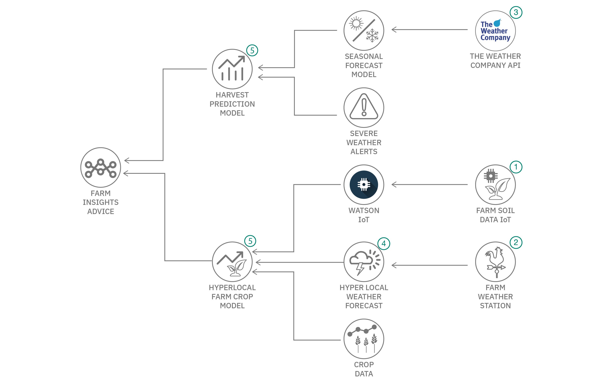

# Water sustainability in the context of climate change 

This solution starter was created by at the United Nations Human Rights Office in Geneva, Switzerland on February 27-28, 2020. It features contributions by technologists from NearForm, IBM, and Red Hat. 

## Authors

* Markus Eisele - Red Hat
* Antoine Marin - NearForm
* Susan Malaika - IBM
* John Walicki - IBM

## Contents

1. [Overview](#overview)
2. [Video](#video)
3. [The idea](#the-idea)
4. [How it works](#how-it-works)
5. [Diagrams](#diagrams)
6. [Documents](#documents)
7. [Datasets](#datasets)
8. [Technology](#technology)
9. [Getting started](#getting-started)
9. [Resources](#resources)
10. [License](#license)

## Overview

### What's the problem?

The global climate crisis is inextricably linked to water. Higher temperatures and more extreme weather events are projected to affect the availability and distribution of rainfall, snowmelt, river flows, and groundwater, and further deteriorate water quality. Low-income communities, already the most vulnerable to any threats to water supply, are likely to be the worst affected. On top of all of this, 70% of water usage worldwide is in agriculture. 
Climate change is causing farmers  to reconsider the crops they grow, but they may not be aware of what crops will work well in the new circumstances, according to the changing water availability. 
Awareness and education of suitable crops and their needs for a good yield,  will help farmers make water-friendly choices. A lot of information is needed to answer these questions. Besides available public datasets it is critical to add local weather data to the forcasting. Further on, most farmers won't have access to these information sources. But they are not alone. With the help of Aggricultural Extension specialists they have a consulting framework in place that let's them profit by simply providing local information in return for forecasts and crop suggestions. 

Read the [UN policy on climate change and water](https://www.unwater.org/publications/un-water-policy-brief-on-climate-change-and-water/) and understand how you can make a difference.

### How can technology help?

Gathering, storing and analyzing the right amount of data to use for a hyper local forecast can only be solved with a combination of technologies. Global weather data and regional forecasts need to be enriched with hyper local weather and soil information to generate the decision making base for harvest timing and crop selection. A combination of hosted services with locally installed devices will provide suitable information aggregation for both the extension specialist and the farmer.

## Video

## The idea

**HyperLocal Aware Farming in a World affected by Climate Change**
To achieve these goals the team propose the creation of a combined software and hardware solution that provides the right tools to make appropriate decisions for extension specialists and farmers. The presented ideas cover the initial steps including a recommendation on hardware and weather data and how to process them towards a full blown recommendation system. An effective and efficient system of accessing information and contributing data back in a way that can improve the foundation of future decisions is key to this cycle.

In order to leverage the benefits of such a system it must be designed to allow for simple ingestion of information, weather data, soil data along with a user-friendly way of drawing insights from it. The team created a platform-based solution that aggregates and analyzes historical and current data related to weather and soil conditions that can be used to derive key insights for future crop, watering and harvesting recommendations.

## How it works

## Diagrams

### Flow

1. Use inexpensive Arduino ESP8622 / ESP32 devices and sensors to measure soil moisture, temperature, humidity. Send data over WiFi or LoraNet using MQTT to IBM Watson IoT Platform.
2. Send the farm Personal Weather Station data to the Weather Underground. Query The Weather Company Personal Weather Station APIs to retrieve and build a dashboard of local weather conditions and forecasts for the farm.
3. Query The Weather Company forecast predictions and historical data APIs. Incorporate Severe Weather Alert API information 
4. Create a hyper local weather forecast for your farm.
5. Build a hyperlocal farm crop model using IoT data, Weather Data and crop data. Build a harvest prediction model to guide the farmer while improving crop yields, lowering water consumption and reducing fertilizer costs.

## Documents

- [Research article - Multifunctional agriculture WUR-INRA](https://www.wur.nl/en/Research-Results/Chair-groups/Plant-Sciences/Farming-Systems-Ecology-Group/Research/Multifunctional-agriculture-WUR-INRA-the-Netherlands.htm)
- [Research article - Weather Forecasting Using Sliding Window Algorithm](https://www.hindawi.com/journals/isrn/2013/156540/)

## Datasets

- [Greenspin GmbH](https://www.greenspin.de)
- [Open data in the agricultural sector](https://www.europeandataportal.eu/en/highlights/open-data-agricultural-sector)
- [Data.world soil data sets](https://data.world/datasets/soil)

## Technology

### IBM Developer Tutorials

- [Build a hyper-local weather dashboard - Use The Weather Company's APIs to build a Node-RED weather dashboard](https://developer.ibm.com/tutorials/collect-display-hyperlocal-weather-data-from-a-pws-cfc-starter-kit-1/)
- [Analyze IoT ESP8266 Sensor Data](https://developer.ibm.com/technologies/iot/tutorials/connect-a-soil-sensor-send-data-to-the-cloud-cfc-starter-kit-1)

### IBM Cloud services

- [The Weather Company APIs](https://callforcode.weather.com/)
- [Watson Studio](https://www.ibm.com/cloud/watson-studio)
- [Watson IoT](https://www.ibm.com/internet-of-things)
- [Watson Machine Learning](https://www.ibm.com/cloud/machine-learning)

### Open source technologies 

- [Scikit-Learn](https://scikit-learn.org/stable/)
- [Node-RED](https://nodered.org/)
- [Jupyter Notebooks](https://jupyter.org/)

### Hardware Components – Suggested components for the farmer to use 

- [Ambient Weather ws-2902](https://www.ambientweather.com/amws2902.html) Personal Weather Station
- [Arduino Uno Wifi](https://store.arduino.cc/arduino-uno-wifi)
- [ESP8266](https://github.com/esp8266/Arduino/blob/master/README.md)
- [Moisture sensor](https://www.amazon.com/Kuman-Moisture-Compatible-Raspberry-Automatic/dp/B071F4RDHY/) 
- [Solar Sensor](https://www.banggood.com/Portable-Mini-5V-60mA-0_3W-Solar-Epoxy-Panel-p-1144421.html)
- [Solar Panel](https://www.cooking-hacks.com/solar-panel-7-4v)
- [Battery](https://www.cooking-hacks.com/2300-ma-h-rechargeable-battery)

## Getting started

### Prerequisite

- Register for an [IBM Cloud](https://www.ibm.com/account/reg/us-en/signup?formid=urx-42793&eventid=cfc-2020) account.
- Request a [Weather Company API key](http://callforcode.weather.com)
- Create an [Internet of Things Starter Kit](https://developer.ibm.com/tutorials/how-to-create-an-internet-of-things-platform-starter-application/)

### Steps

#### Analyze IoT sensor data

- In this extensive [tutorial](https://developer.ibm.com/tutorials/connect-a-soil-sensor-send-data-to-the-cloud-cfc-starter-kit-1/), you'll learn how to connect an ESP8266 to Watson IoT over MQTT and stream environmental data from the sensors to the IBM Cloud.

#### Build a weather dashboard

- This quick [tutorial](https://developer.ibm.com/tutorials/collect-display-hyperlocal-weather-data-from-a-pws-cfc-starter-kit-1/) demonstrates how to display hyper-local weather information from a residential or farming weather station, using a personal weather station, Node-RED, Weather Underground, and The Weather Company APIs and the node-red-contrib-twc-weather nodes.

## Resources

- [Words into Action guidelines: Build back better in recovery, rehabilitation and reconstruction](https://www.unisdr.org/we/inform/publications/53213)
- [Sendai Framework Priority 4: Build Back Better](https://www.youtube.com/watch?v=mRTlS3ZfljM)
- [Open data in the agricultural sector](https://www.europeandataportal.eu/en/highlights/open-data-agricultural-sector)

## License

This solution starter is made available under the [Apache 2 License](LICENSE).
